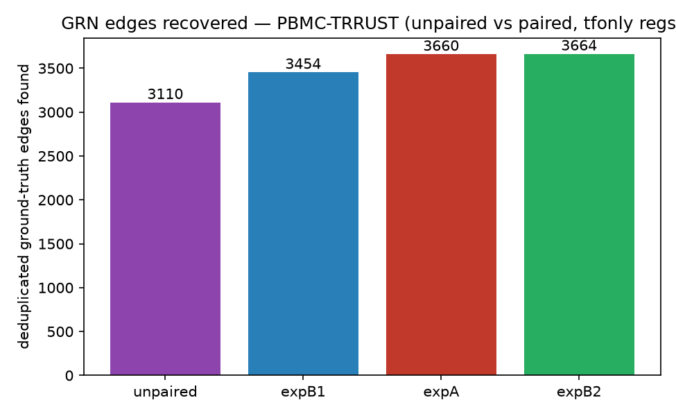
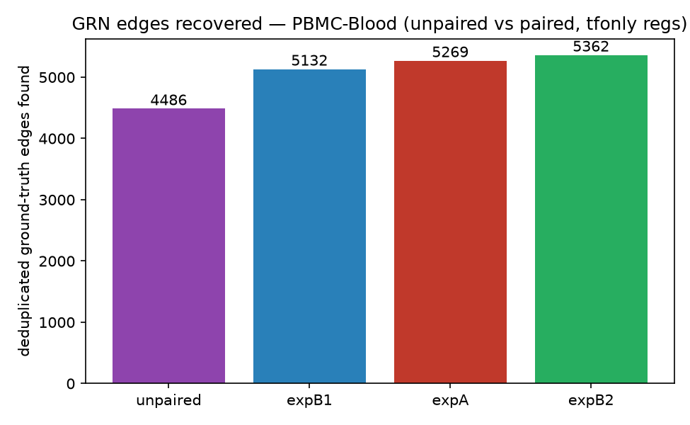
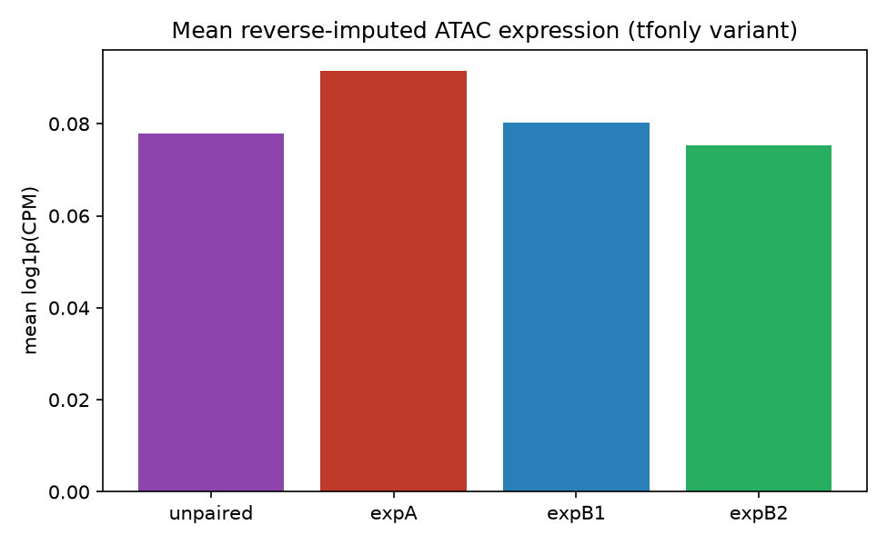
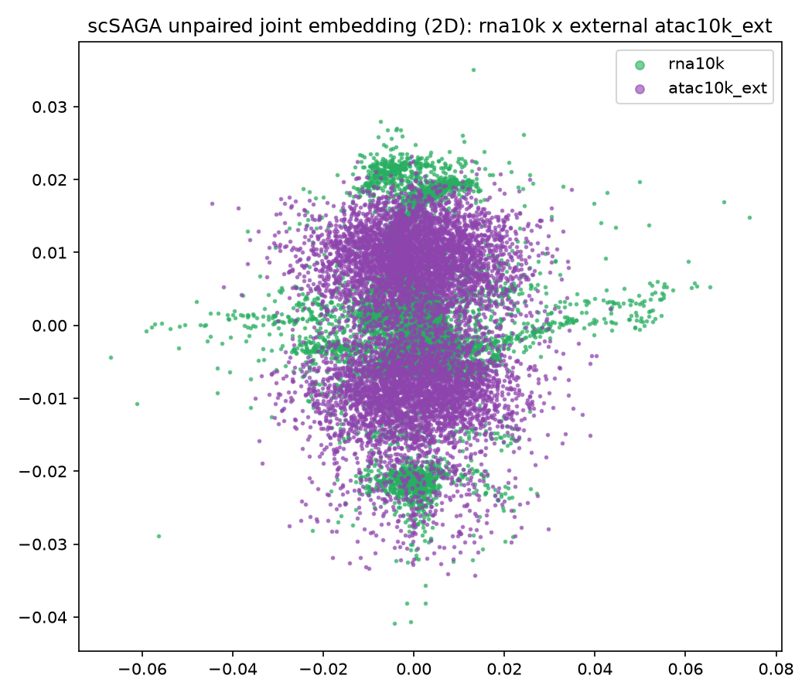

# Comparison report — unpaired 10k (multiome RNA x external 10x ATAC v1.1)

Variant of the full-10k TF-only-regulator experiment in which the ATAC modality is a
**separate 10x dataset** rather than the multiome's own ATAC. Regulators and targets are
identical to `reports/full_10k_3k_onlyTf/` (regulators = `data/tf_only.txt`, targets =
`trrust_tf.txt` genes present), so these numbers are constructed the same way.

## Design

| Item | Unpaired run | Paired full-10k runs |
|---|---|---|
| RNA | 10k multiome RNA (11,898 cells) | 3k + 10k multiome RNA |
| ATAC | **external 10x 10k PBMC ATAC v1.1** (8,161 cells, hg19) | multiome ATAC (hg19/GRCh38 per dataset) |
| Shared nuclei | **none** (barcode overlap 0) | all (paired multiome) |
| Anchor | rna10k | rna3k |
| Cells in all-cells matrix | 20,059 | 29,218 |
| Regulators | tf_only.txt present (**816**) | tf_only.txt present (816) |
| Targets | trrust_tf.txt genes present (**2,827**) | trrust_tf.txt genes present (2,827) |
| Union columns | 2,852 | 2,852 |
| `n_workers` | 4 | 4 (tfonly_reg) / 2 (trrust) |

Reference strategy: the unpaired run uses the single 10k RNA reference (expB2 analogue),
not SCEMENT-combined.

## GRN overview

| Run | Cells | Inferred edges | PBMC-TRRUST recovered | PBMC-Blood recovered |
|---|---|---|---|---|
| **unpaired (this run)** | 20,059 | 659,314 | 3,110/8,751 (35.5%) | 4,486/96,846 (4.6%) |
| expA (paired, SCEMENT ref) | 29,218 | 829,982 | 3,660/8,751 (41.8%) | 5,269/96,846 (5.4%) |
| expB1 (paired, 3k RNA ref) | 29,218 | 779,701 | 3,454/8,751 (39.5%) | 5,132/96,846 (5.3%) |
| expB2 (paired, 10k RNA ref) | 29,218 | 832,664 | 3,664/8,751 (41.9%) | 5,362/96,846 (5.5%) |

*Paired values from `scripts/_tfonly_eval_data.json` (`pbmc-full10k-grn` checkout). This
run's evaluator was validated by reproducing expA exactly, so the comparison is
methodologically sound.*

## Unpaired vs paired: magnitude and caveats

Recovered PBMC-TRRUST fraction is **35.5%**
(unpaired) vs **39.5-41.9%** (paired) — the unpaired run reaches ~85-90% of the paired
fraction with 31% fewer cells and a completely different ATAC dataset.

This is **context, not a controlled comparison**: cell count, ATAC cell number
(8,161 vs 11,898) and the ATAC feature vocabulary (87,863 vs 143,887 peaks) all differ.
Do not read the difference as a clean measurement of the cost of being unpaired.

## Precision@K / Recall@K — PBMC-TRRUST

| Top-K | Precision@K | Recall@K |
|---|---|---|
| 100 | 0.05 | 0.0006 |
| 500 | 0.038 | 0.0022 |
| 1,000 | 0.025 | 0.0029 |
| 5,000 | 0.0168 | 0.0096 |
| 10,000 | 0.0147 | 0.0168 |
| 659,314 | 0.0047 | 0.3554 |

## Precision@K / Recall@K — PBMC-Blood

| Top-K | Precision@K | Recall@K |
|---|---|---|
| 100 | 0.03 | 0.0 |
| 500 | 0.024 | 0.0001 |
| 1,000 | 0.023 | 0.0002 |
| 5,000 | 0.0186 | 0.001 |
| 10,000 | 0.0182 | 0.0019 |
| 659,314 | 0.0068 | 0.0463 |

## Top 25 edges

| TF → target | importance |
|---|---|
| EBF1 → PAX5 | 189.4665 |
| ZEB2 → LTB | 160.0582 |
| EBF1 → MS4A1 | 148.0450 |
| TCF7L2 → CDKN1C | 147.9104 |
| LEF1 → PRKCA | 147.7347 |
| FOSB → JUN | 147.3921 |
| GATA2 → ERG | 143.4247 |
| PAX5 → EBF1 | 141.1844 |
| CREB5 → VCAN | 138.0819 |
| LEF1 → FHIT | 133.8027 |
| HDAC3 → DUX4 | 133.7407 |
| EBF1 → CD79A | 131.9341 |
| MYBL1 → CCL5 | 128.3924 |
| LEF1 → NELL2 | 126.3195 |
| TCF4 → RUNX2 | 126.1091 |
| TCF4 → CLEC4C | 122.5741 |
| NEAT1 → VCAN | 121.9006 |
| LEF1 → CCR7 | 120.4034 |
| PAX5 → MS4A1 | 120.2438 |
| ZEB2 → BCL2 | 120.1024 |
| NEAT1 → NAMPT | 118.7517 |
| NEAT1 → ACSL1 | 117.2167 |
| ETS1 → DUX4 | 113.7856 |
| NEAT1 → VMP1 | 112.7484 |
| LEF1 → TCF7 | 112.4250 |

## QC summary

Imputation is biologically coherent: clustering the 8,161 external ATAC cells on their
**own peak PCA** (no RNA, no alignment) and matching imputed marker profiles against
independently-derived RNA clusters gives mean matched r = **+0.741** vs **+0.485** for a
shuffled control, with correct lineage assignment for B (r=+0.992), NK/cytotoxic
(+0.920), T (+0.881) and monocyte (+0.781).

Known degradation:
- marker amplitude attenuated (signal-to-noise <1 for CD3D, IL7R, LYZ, CD14)
- rare populations lost (PPBP platelets snr 0.10, FCER1A basophil/DC snr 0.09)
- imputation concentrated: nearest reference of all 8,161 queries drawn from only 2,831 of
  11,898 RNA cells; imputed cells correlate 0.857 with each other vs 0.394 for real cells
- 40.7% of GRN rows are imputed

Block-mixing statistics are **not** diagnostic here: the fraction of same-modality
neighbours is 0.988-1.000 for most blocks in the repo's *paired* runs too, so it reflects
scSAGA's partial-alignment construction, not unpaired failure. Full QC in
`qc_imputation.txt`, `qc_mixing.txt`, `qc_biology.txt`.

---

Full pipeline detail: `REPORT.md`. Raw evaluation: `../../results/unpaired_grn/grn_tfonly_reg/evaluation/`.
